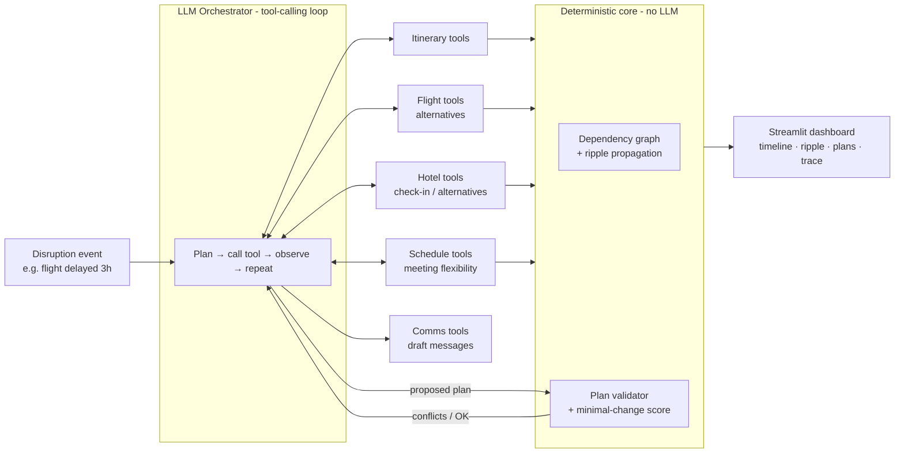

# 🌊 TripShift AI — Travel Disruption & Autonomous Replanning Agent

> One delay breaks a whole journey. **TripShift** finds every itinerary item the change touches, proposes recovery plans, **verifies them with deterministic checks before showing them**, and drafts the messages to everyone affected.

Built at **TECHNOVA '26 — Track 2: AI Agent Challenges** (PCE, Nagpur).
Problem statement: *AI Travel Disruption & Autonomous Replanning Agent.*

<!-- TODO (after the inauguration): paste the official problem statement text here if it differs from the one above. -->

---

## The problem

A real trip is a chain of dependencies: a flight lands → a transfer starts → the hotel check-in window → tomorrow's 9 AM meeting. When one event changes, most tools just generate *another itinerary*. They don't understand **which items are now broken, which are merely at risk, and what the smallest fix is**. Research on LLM itinerary revision shows quality drops as itineraries get longer, because models lose track of the chain.

## Our approach: *LLM proposes, code verifies*

The LLM is great at judgement and language; it is unreliable at time arithmetic and constraints. So we split the work:

| Job | Done by |
|---|---|
| Understand the disruption, choose which tools to call, weigh trade-offs, write messages | **LLM agent** (tool-calling loop) |
| Dependency graph, ripple propagation, slack/conflict math, plan validation | **Deterministic Python** (no LLM) |

Every recovery plan the agent proposes is **re-simulated by the validator**. If it creates a conflict (missed connection, overlapping meetings, closed check-in), the conflicts are fed back to the agent, which repairs the plan. The user only ever sees verified plans.

## Key features

- **Ripple map** — the disruption's blast radius drawn across the timeline: items marked *OK / at risk / broken*, each with a reason and remaining slack.
- **Verified recovery plans** — 2–3 alternatives with trade-offs (time, cost, number of changes), each with a ✅ validation badge.
- **Minimal-change replanning** — plans are scored by how few items they touch and how far things shift.
- **Self-correcting loop** — validator feedback goes back to the agent until the plan is conflict-free (or it reports it can't be).
- **Stakeholder messages** — drafted notes for the hotel, meeting attendees, driver, etc.
- **Live agent trace** — every thought, tool call and result visible in the UI.
- **Provider failover** — automatic fallback across several LLMs if one is rate-limited or misbehaves.

## Architecture



### Agent roles (from the problem statement) → implementation

| Role | Implemented as |
|---|---|
| Itinerary | `tools/itinerary_tools.py` — read/modify the current itinerary |
| Flight | `tools/flight_tools.py` — search alternatives in simulated flight data |
| Dependency | `core/graph.py` — graph build + ripple propagation |
| Hotel | `tools/hotel_tools.py` — check-in rules, late arrival, alternatives |
| Schedule | `tools/schedule_tools.py` — meeting flexibility and conflicts |
| Replanning | Orchestrator agent + `core/validator.py` feedback loop |
| Communication | `tools/comms_tools.py` — message drafts per stakeholder |

## Tech stack

Python 3.10+ · OpenAI-compatible LLM APIs (Groq, Google Gemini, optional local Ollama) · NetworkX · Streamlit · Plotly · Pydantic

## Repository layout

```
tripshift-ai/
├── app.py                  # Streamlit dashboard
├── agent.py                # LLM tool-calling loop + provider failover
├── core/
│   ├── models.py           # Item, Itinerary, Change, Plan, reports
│   ├── graph.py            # dependency graph + ripple propagation
│   ├── validator.py        # apply & verify plans, minimal-change score
│   └── state.py            # shared session state (itinerary, ripple, plans, messages)
├── tools/
│   ├── registry.py         # TOOL_SCHEMAS + TOOLS exposed to agent.py
│   ├── itinerary_tools.py
│   ├── flight_tools.py
│   ├── hotel_tools.py
│   ├── schedule_tools.py
│   └── comms_tools.py
├── data/
│   ├── scenarios/          # itinerary + disruption JSON files
│   ├── flights.json
│   └── hotels.json
├── ui/components.py        # timeline, ripple and plan-card renderers
├── tests/                  # validator + graph tests
├── AI_CONTEXT.md           # shared context for AI coding assistants
├── requirements.txt
└── .env.example
```

## Setup

```bash
git clone https://github.com/<your-org>/tripshift-ai.git
cd tripshift-ai
python -m venv venv && source venv/bin/activate   # Windows: venv\Scripts\activate
pip install -r requirements.txt
cp .env.example .env    # then add your API keys
streamlit run app.py
```

`.env`

```
GROQ_API_KEY=...
GEMINI_API_KEY=...
PROVIDER=auto
# Optional: order of models to try; the task restarts on the next one if a model fails
# AGENT_CHAIN=groq:openai/gpt-oss-120b,groq:qwen/qwen3.8-27b,gemini:gemini-3.5-flash-lite
```

CLI mode (no UI): `python agent.py "Flight AI-660 is delayed by 3 hours. Replan my trip."`

## Demo scenarios

<!-- TODO: finalize names after building the scenario files. -->

1. **Flight delay** — misses a transfer, risks hotel check-in, collides with a morning meeting.
2. **Cancellation** — needs a replacement flight and cascading changes.
3. **Impossible case** — no valid plan exists; the agent says so instead of inventing one.

## Failure boundaries & safeguards

- The LLM **never computes** times or conflicts; the validator does.
- Unverified plans are never shown as recommendations.
- If no conflict-free plan is found within the step limit, the agent reports what is blocked and why.
- Tool errors are returned to the agent as text so it can try another approach; they don't crash the run.
- Malformed model output is re-sampled; repeated failures trigger failover to the next model.
- Flight and hotel data are **simulated**; no real bookings are made. A human confirms any plan.

## Model choice

Tool-calling LLMs through OpenAI-compatible endpoints, so providers are interchangeable. A fast Groq-hosted model is primary for responsiveness; Gemini is the backup; Ollama is the offline fallback. See `agent.py`.

## Team

| Name | Role |
|---|---|
| [Name A] | Core engine (graph, validator) |
| [Name B] | Agent, tools and prompts |
| [Name C] | Data, UI and demo |

## Roadmap

- Live flight-status and weather feeds
- Real booking integrations with human approval
- Multi-traveller group itineraries
- Learning traveller preferences over time

## License

MIT
